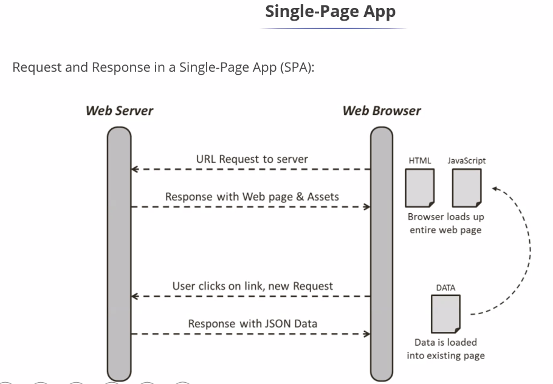

# React
This repo has React code snippets for various angular concepts that were learnt

Once you have node and npm installed you should install react globally.

Step 1: Check for the available node and the npm versions
node-v
npm-v

Step 2: npm install -g create-react-app
Step 3: npx create-react-app appName
step 4: cd app_name on the terminal
step 5: npm start

React is a javascript. Is used for building reusable UI components

Project Folder Structure

In critical part of react is component. Like Angular we don't have pipes and services

React components is a building blocks of the react application. They encapsulate UI and behaviour of the part of the applicaiton.

React.createElement(<type>,<props>,<content>)

React.createElement retruns one root element

Syntax of render ReactDOM.render(<Element>,<container>)

JSX: Is a blend of 2 things
Javascript and HTML

Components

Class Component (Outdated)
Functional Conponents (These are called hooks)

Class Component (Outdated)

Stars with a class keyword
must include extends react

Example 
Class ABC extends React.Component
{
    render(){
        return <h1>This is a class component</h1>;      
    }
}

function welcome (){
    return <h1>This is a class component</h1>;
}
export default welcome();

State is a built in react object that can be used for 

props vs state

Both hold information that influence the output

props gets passed to the component as a parameter similar to functional parameter.
State is managed within the component is similar to a variable declared within a function.

props is used to pass data between react componets. The props are passed uni directional from parent to child component.

State allow the component to create and manage their own data.

Components can update their state using the this.seState() method.
wheneve setState() is called, React rerenders the entire app and updates the UI.
This Component's UI is a function of the Component State as indicated below.

UI=fun(state)

After Version 16 we are using functinal components

useState hook is a way to manage state within the functional components.

Communication between components can happen using the following ways

1. Props
2. Context API
3. Third party state management (library like Redux)

Communication
1. parent to child component communication 
2. child to parent compoennt communication
3. between 2 components where there is no parent child relationship between them.

ContextApi is a way to create a global state for any component can access. This method is more scalable and easy to maintain in larger applications

React routing

step 1: npm i react-router-dom
step2: import {BrowserRouter,Routes,Route,link} from 'react-router-DOM"

BrowserRouter - Router implemenation HTML 5 history API to keep the UI sync with the URL
Routes - 
Route - conditionally render
link- like HTML anchor tags

